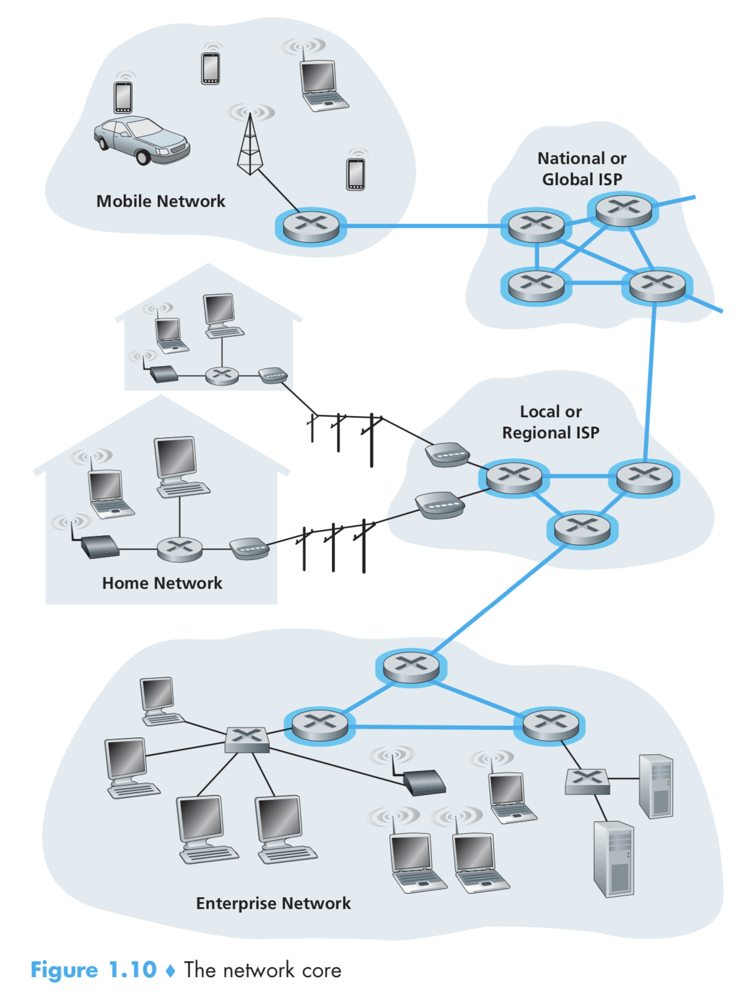

## 1.3 网络的核心（The Network Core）

之前已经介绍了互联网的“边缘地带”，现在让我们更深入的探索网络的核心——数据包（Packet）交换网络和连接着各种端系统（End System）的连接（link）。图 1.10 用加粗的，有阴影的线条高亮了网络的核心。

> 网络核心，按作者描述的，就是各种用于交换数据包的交换机、路由器所构建的交错纵横的网络。这里我顺便分享一下关于 Hub、交换机（Switch）和路由器（Router）的一个小知识。 
Hub：收到一份数据，并转发给其他连着自己的设备。
交换机：收到一份数据，读取数据包的 MAC 地址，转发给这个 MAC 地址的机器。 
路由器：收到一份数据，读取数据包中的 IP 地址，根据这个 IP 转发到下一个网络或设备。 
可见，Hub 和交换机用来构建一个网络，路由器则用来连接多个网络构建一个更大的网络。

### 1.3.1 报文交换（Packet Switching）

在一个网络应用中，各种端系统彼此交换着消息（Message）。应用的设计者可以在消息里面包含任何他想要包含的信息。消息可以执行一个控制功能（比如，在握手协议中的 Hi 消息，如图 1.2）

消息也可以包含像邮件、图片或者 MP3 这样的数据。为了能将一条消息从一个端系统发送到另一个端系统，这条消息会被分割成体积更小的数据块，被称为数据包（packets）。在出发地和目的地之间，每个数据包都穿梭于各种通信链路和报文交换机之间。

> 报文交换机：原文是 packet switches，应该是指可以执行交换包的各种各样的设备。

在某个通信链路中传输的数据包，它的传输速率和这条链路的最大速率（full transmission rate）相同。所以，如果发送源或者一个路由器要在速率为 R bit/s 的通信链路上发送一个长度为 L bits 的数据包，所需要的传输时间为 L/R s。

#### 存储与转发（Store-and-Forward Transmission）

绝大多数的交换机都使用存储与转发的策略。存储与转发的意思是，交换机发送这个数据包之前，必须完全的接收整个数据包。为了探索更多关于存储与转发的细节，我们考虑一个简单的网络，这个网络由两个端系统和一个路由器构成，如图 1.11 所示。

一个路由器通常有很多个连接，因为它的工作就是将输入的数据包转发到输出的链路上去。在我们的这个简单的例子上，路由器的任务只需要简单的将数据包从输入的链路发送到输出的链路即可。如图的示例中，source 有 3 个长度为 L 数据包要发送，如图所示的这一瞬间，第 1 个数据包的一部分，已经被路由器所接收了。因为路由器使用了存储与转发的策略，所以，路由器现在没办法发送它接收的数据，它必须要缓存住这个数据包的所有数据。一旦它接收到了这个数据包的所有数据，它就可以开始发送了。

为了存储与转发策略有更多的理解，我们来计算一下从发送端开始发送数据，到接收端完全接收数据，所花费的时间。（这里我们忽略掉传输的耗时，因为 bit 在链路中是以光速传播的，将在 1.4 讨论这些）

在开始发送之前，时间点为 0，在 L/R s 后，发送端已经传送完整个数据包，路由器也接收并存储了，路由器可以开始传输数据包到目的地，在时间点 2L/R s 时，路由器已经完全传输了数据包，目的地已经接收。所以，总共的延迟为 2L/R s。如果路由器在它收到数据后直接转发，而不是先存储。则总共的耗时将会是 L/R s，因为数据不会被路由器拦住。但是这么做是有道理的，我们将在 1.4 详细讨论这么做的原因。

现在，让我们来计算一下所有三个数据包从发送到接收的时间。像之前一样，在时间点 L/R s 时，路由器开始转发第一个包，与此同时，发送源也开始发送第 二 个包了，在时间点 2L/R s 时，路由器收到了第二个包，第一个包已经到达了目的地，在时间点 3L/R s 时，路由器收到了第三个包，第二个包到达了目的地。在时间点 4L/R s 时，所有的数据包都抵达了目的地。

让我们来考虑下更通用的情况，一个数据包从发送端到接收端，以速率 R 经过 N 条链路（这时，在整个链路上有 N - 1 个路由器）运用上面的逻辑，我们可以得到端到端的延迟为：

**delay = NL / R**

现在，你可能想知道 P 个数据包经过 N 条链路需要消耗多少时间。

#### 排队延迟和丢包（Queuing Delay and Packet Loss）

每一个交换机（或者路由器，原文 packet switch）都有多个链路连上它。对每一个连接，交换机都有一个输出缓冲（output buffer，也被称为输出队列 output queue），里面存储着准备要发送出去的数据包。在包转发过程中，输出缓冲扮演了非常重要的角色。如果一个刚刚抵达的数据包准备要发送出去，而此时输出链路正在忙着传输其他的数据包，那么这个新来的数据包就不得不在输出缓冲中等待。这样，除了存储转发的延迟外，每个数据包还有排队延迟（queuing delays）。这些延迟是动态变化的，取决于网络拥挤的程度。因为缓冲的空间是有限的，一个新到的数据包可能会发现缓冲区已经完全被其他数据包填满了，而不得不等一直等待。在这种情况下，就会发生丢包（packet loss）——新到的数据包或者已经排队的数据包，将会被丢弃。

图 1.12 描绘了一个简单的报文交换网络，在图 1.11 中，数据包用 3D 的板块表示，这些板块的宽度表示了有多少个 bit 在数据包里面。在图 1.12 中，所有的数据包都有相同的宽度，也就是说，它们都有一样的数据长度。

假设，主机 A 和 B 都正在发送数据包给主机 E。主机 A 和 B 首先在 10 Mbps 的以太网链路上发送数据包给第一个路由器。这个路由器随后将这些数据包转发到 1.5 Mbps 的链路上。如果，在某个瞬间，数据包抵达路由器的速率超过了 1.5 Mbps，在路由器的缓冲到输出链路上就发生了拥堵。

> 很容易理解这种拥堵是如何发生的，我用更形象的事物比喻一下，路由器是个 5 米粗的水管，左边连上了两条 10 米粗的进水管，右边连上了一条 1.5 米粗的出水管。假设两个进水管每秒都进 0.1 米直径的水，显然可以完全顺畅的通过 5 米粗的路由器，也可以通过 1.5 米粗的出水管。假设两个进水管每秒的流量是 0.75 米，这样合计的流量就是 1.5 米，出水管刚好可以容纳。如果进水管的流量是 1 米，那么合计就是 2 米，对于路由器来说，是完全可以容纳的，但是对于出水管来说，就有一些拥挤了。有一些水不得不在路由器里等一会，才能进入出水管，而由于堆积排队的效应，有一些水，由于等待的时间太久了，不得不被路由器抛弃。

#### 转发表与路由协议（Forwarding Tables and Routing Protocols）

在前面的内容中，我们已经介绍过路由器从链路中得到一个数据包，然后转发到另一条链路上。那么问题来了，路由器是怎么知道一个数据包应该发送到哪条链路上呢？事实上，在不同类型的计算机网络上有不同的包转发方式。这里，我们简要的描述在 Internet 上是怎么回事。

在 Internet 中，每一个端系统都有一个称为 IP 地址的地址。当发送端想要发送一个数据包到接收端，发送端要将接收端的 IP 地址包含在包的头部（header）里面。就如同邮件系统一样，IP 地址本身是具备层级结构（hierarchical structure）的。

> 这里所说的层级结构是指 IP 地址实际上是一个由大到小的分层结构，如同现实生活中的地址一般，比如：四川省成都市武侯区xxx路，这个地址就分为 4 个层次，首先是指明了哪个省，接着指明哪个市，接着指明哪个区，接着指明是什么路。IP 地址也具备这样的结构。

当一个数据包抵达一个路由器时，路由器会检测这个数据包目标地址的一部分，然后将它转发到邻近的路由器上。更准确的说，每个路由器都有一个转发表（forwarding table），这个转发表记录了目的地地址（或者目的地地址的一部分）与路由器出口链路（outbound links）的映射关系。当一个数据包抵达路由器，路由器检测这个地址，并在转发表里面搜索，以此来找到合适的出口链路。

端到端路由的处理过程和不知道地图的司机问路类似。举个例子，假设 Joe 开车从广州开往深圳，Joe 首先开到最近的加油站，并问道，怎么去深圳啊？加油站的小哥告诉他，你先顺着这条路一直走，开到 A 加油站再问那里的人吧。于是 Joe 开车开到了 A 加油站，并问道，怎么去深圳啊？加油站小哥告诉他，你先顺着右边这条路走，开到 C 加油站再问问那里的人吧……以此类推。

我们已经知道了路由器通过数据包的目的地地址来查找转发表并决定要发送到哪条链路上，但是这又抛出了另一个问题：转发表是如何建立的？它们是被手动配置的？还是整个互联网的所有路由器都是自动配置的？这个问题将在第 4 章被深入的探讨。但是话都说到这里了，为了满足你们的好奇心，简要说明一下，互联网有一系列的路由协议（routing protocols），它们会自动的配置转发表。路由协议可以算出任意路由器到任意目的地的最短路径，并且将这个路径写入到路由器的转发表中。

是不是想看一看在互联网中数据包是如何被路由的呢？现在我们邀请你实际操作一把，通过 Trace route program。访问 www.traceroute.org，在某个国家中选择一个 source，然后追踪这个 source 是如何路由到你的计算机上。

> 亲自试了一下，感觉不好使啊（哭）

### 1.3.2 电路交换（Circuit Switching）

有两种在网络中传输交换数据的方法：电路交换（circuit switching）和报文交换（packet switching）。在上面的小节中已经描述了报文交换的内容，现在我们将注意力转向电路交换网络。

在电路交换网络，在端系统之间为通信所用的资源将在通信会话期间被保留（reserved），这些资源，指的是缓冲区，以及传输速率。在报文交换网络中，这些资源不会被保留；一个会话的消息要求使用这些资源，结果要么是等待（在队列中），要么就是直接使用了。考虑一个类似的例子，有两个餐厅，其中一个要求预定，而另一个餐厅则不要求预定。对于要求预定的餐厅来说，我们需要在离开家前往的时候，打一个预定的电话，这样是有点麻烦，但是，当我们到达餐厅的时候，我们可以立马就坐开始点菜。对于不需要预定的餐厅来说，如果没有桌位了，我们就不得不等着。

传统的电话网络就是电路交换网络的一个实例。思考一下在电话网络上，一个人要发送信息给另一个人会发生什么。在发送者可以发送信息之前，必须先在发送者和接受者之间建议一个连接。这是一个称为 bona fide 的连接，由在发送者和接收者之前的路径上的交换机维持。用电话系统的术语，这个连接被称为电路（circuit）。当网络建立好了连接，它同时预留了一定的传输带宽。因为已经预留了传输带宽，所以在通信期间，发送者和接收者的通信速率可以得到保证。

图 1.13 描绘了电路交换网络。

在这个网络中，四个电路交换机通过四条链路相互连接在一起。每一条链路都有四条电路（看图中黑色的细线），所以每条链路可以支持四条同时发生的通信。主机则是直接连接在其中一个交换机上。当两个主机想要通信，网络会建立一条端到端的连接。所以，为了主机 A 可以和主机 B 进行通信，网络必须为这条链路预留一个电路。在如图的这个示例中，请注意蓝色加粗的部分，第一条链路上使用了第二条电路（从上往下第二条），第二条链路上，使用了第一条电路（最左侧那条）。因为每条链路有四条电路，所以每个连接都只能获得 1/4 的链路总带宽。如果整个链路有 1 Mbps 的带宽，则每条电路只有 250 kbps 的带宽。

作为对比，考虑一下在互联网中，一个主机想发送一个数据包到另一个主机的时候，会发生什么？和电路交换一样，数据包会传输穿过一系列的通信链路。但是与电路交换不同的是，网络不会为数据包预留任何通信资源。如果一个链路上有很多其他的数据包要发送，那么这条链路就会发生拥堵，新到的数据包不得不等待缓冲被清空，不得不承受所产生的延迟。互联网会为及时的传输数据包做最大的努力，但不提供任何保证。

#### 在电路交换网络中的多路复用（Multiplexing in Circuit-Switched Networks)

链路中的电路通过频分复用（frequency-division multiplexing FDM）或时分复用（time-division multiplexing TDM）来实现。在 FDM 中，一条链路的频率范围被拆分开来用于不同的连接。具体来说，链路拆分自己的频率波段提供给不同的连接。在电话网络中，频率波段通常有 4kHz 的宽度。这个波段的宽度被成为带宽（bandwidth）。FM 无线电台也使用 FDM 的方式来共享 88 MHz ~ 108 MHz，每一个电台都被分配了指定的频率带宽。

对于 TDM 链路，时间以固定时长拆分成帧（frame），每个帧又被拆分成固定数量的 time slot（应该是固定的一小段时长）。当在这样的链路上建立连接，会在每一帧里面贡献出一个 time slot。每一个 time slot 都被用于一个连接传输数据。

图 1.14 描绘了 FDM 和 TDM 在链路上支持 4 个电路的情况。

对于 FDM，频率的范围被分为 4 段，每一段的带宽都是 4kHz。对于 TDM，时间的范围被分为很多帧，每一帧里面有 4 个 time slot。在解析 TDM 帧的时候，每个电路都被安排使用同一个 time slot。TDM 的传输速率等于帧率乘以一个 slot 里面的 bit 数。比如说，一条链路每秒传输 8000 个帧，每个 slot 包含 8 bits，所以这条电路的传输速率为 64kbps。

报文交换的倡导者已经多次谈论过电路交换的浪费，因为预先被分配的电路存在空闲时间。比如说，一个正在打电话的人没有说话，这些空闲的网络资源就没有办法被其他连接使用。还有另一个例子，假设有一个放射学家使用电路交换的网络来访问关于 X 光的资源。这个放射学家建立连接，请求一张图片，然后陷入思考，然后再请求一张新的图片。在放射学家正在思考的时候，那些已经被分配的网络资源就没法被复用。报文交换的倡导者也指出建立端到端的电路，保留端到端的传输能力很复杂，需要复杂的信号软件来定位数据是属于哪一条连接的。

> 澄清一些概念，链路，电路，连接。
链路我的理解是一系列的线缆捆绑在一起组成的一条线，它可能是一根双绞线，或者同轴电缆，比如两个路由器之间用一条双绞线连接，这条连接称之为链路。
电路是指在电路交换过程中建立的连接，这条连接应该是会占用某条物理上的线路，比如双绞线中的某一根？这个细节我不太清楚。
连接是指业务层面的连接，我和你建立一个连接来通信，就是这样的字面意思，而不涉及具体是怎么建立连接的。

在我们完成对电路交换的讨论前，再来看一组数据的示例，应该更能帮我们洞悉整个主题。考虑一下从主机 A 传输一个 640000 bits 的文件到主机 B 需要多少时间，640000 bits 大约是 78 KB 大小的文件。假设所有的链路使用 TDM，每一帧有 24 个 slot，比特率为 1.536 Mbps，再假设建立连接需要 500 毫秒。好，那么到底需要多少时间呢？每条电路的比特率是 1.536 / 24 = 64 kbps，所以传输整个文件需要的时间为 640000 / 64 = 10 秒，再加上建立连接的时间，总共是 10.5 秒。记住传输时间和链路的数量没有关系：要通过一条或者通过 100 条所需要的时间都是 10 秒。

#### 报文交换 vs 电路交换

报文交换和电路交换我们都讲过了，现在来比较一下。报文交换的批评者经常说报文交换并不适用于一些实时服务（比如说电话或者视频会议），因为它的不确定性和不可预期。而报文交换的倡导者则说：（1）它比电路交换能更好的共享传输能力，（2）更简单，更高效，更少的花费。一个更有意思的评论是：通常来说，一般觉得餐厅预订很麻烦的人，都更加偏爱报文交换，而不是电路交换。

为什么报文交换更高效？让我们看一个简单的例子。假设一些用户共享一个 1 Mbps 的链路，再假设每个人都是交替活动的（一个用户在生成数据，而另一个用户可能没有生成数据），假设一个用户只有 10% 的时间在活动，其他时间都是空闲的。如果使用电路交换，必须一直为每个用户都必须保留 100 kbps 的带宽。比如说使用 TDM ，一个 1 秒的帧被分割为 10 个 slot，每个都是 100ms，每个用户在每个帧里都被分配了一个 time slot，这样的话，电路交换网络仅可以同时支持 10 个用户。

而报文交换的话，由于每个用户在线的几率是 10%，如果有 35 个用户，其中 11 个或者更多用户同时在线的可能性是 0.04%。当有 10 个或者更少的用户同时在线（可能性为 99.96%），总的数据传输速率是小于等于 1Mbps，所以，当 10 个或更少的用户同时在线，传输数据包本质上是没有延迟的，通常情况下电路交换也是如此（原文：as is the case with circuit switching）。当有超过 10 个或更多的人同时在线时，数据包到达速率的总和就会超出链路的输出容量，输出队列因此会不断增长。（它会持续不断的增长，直到输入速率低于 1 Mbps，从那个瞬间开始，输出队列开始不断缩减）在这个例子中，同时超过 10 人在线的可能性是非常小的，所以报文交换的性能本质上与电路交换相同，但是，报文交换允许超过 3 倍的用户数。

现在让我们考虑第二个简单的例子。假设这里有 10 个用户，其中有一个用户突然产生了 1000 个 1000 bit （总共 1,000,000 bits） 的数据包，此时其他的用户都处于不活跃的状态。在 每帧有 10 个 slot，每个 slot 容纳 1000 bit 的 TDM电路交换网络中，那个活跃的用户只能使用属于他的那一个 slot 传递数据，而其他的 9 个 slot 都处于空闲状态。要将这个用户的所有数据传送完毕，将花费 10 秒钟的时间。（这里似乎有个隐含的条件是 1 秒钟有 100 帧）而在报文交换的网络中，这个活跃用户可以持续的以满速 1Mbps 发送数据，因为没有其他的用户需要使用到网络资源。使用报文交换，所有的数据将在 1 秒钟传输完毕。

上面的例子中描述了两种方式下报文交换的性能优于电路交换。