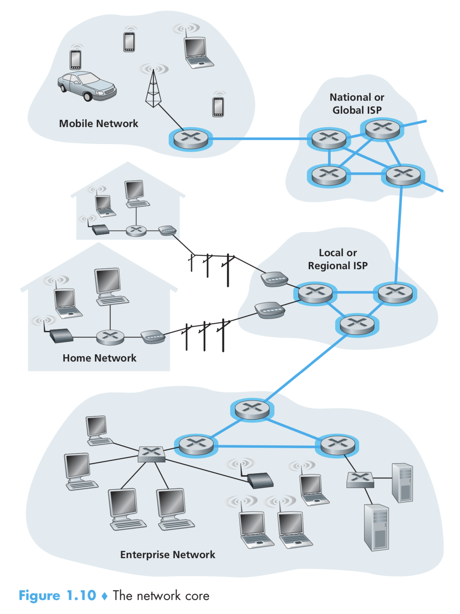
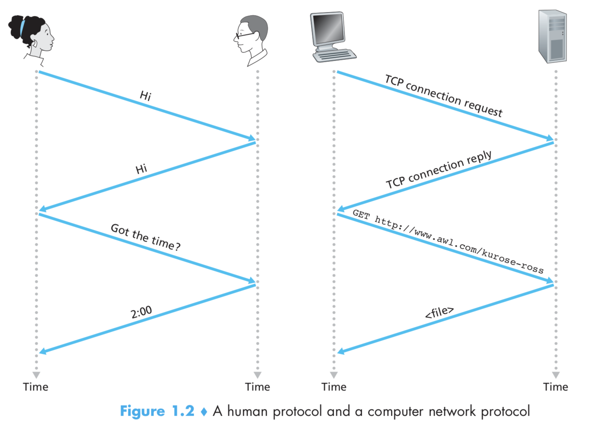
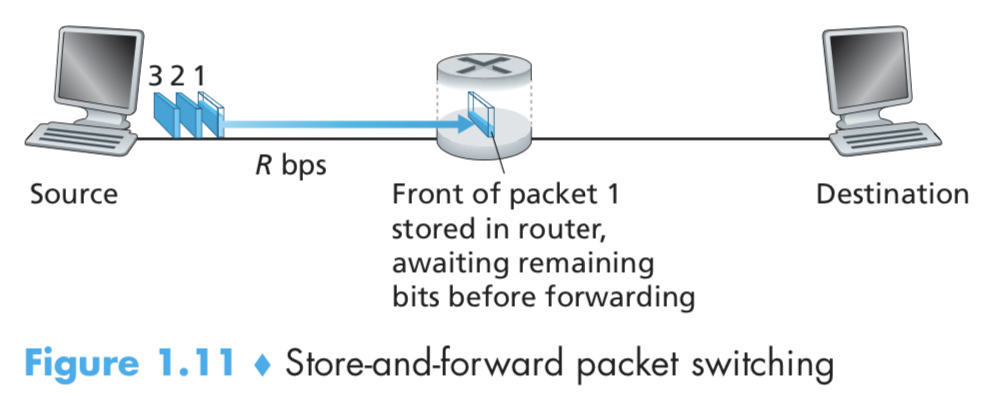

## 1.3 网络的核心（The Network Core）

之前已经介绍了互联网的“边缘地带”，现在让我们更深入的探索网络的核心——数据包（Packet）交换网络和连接着各种端系统（End System）的连接（link）。图 1.10 用加粗的，有阴影的线条高亮了网络的核心。

> 网络核心，按作者描述的，就是各种用于交换数据包的交换机、路由器所构建的交错纵横的网络。这里我顺便分享一下关于 Hub、交换机（Switch）和路由器（Router）的一个小知识。 
Hub：收到一份数据，并转发给其他连着自己的设备。
交换机：收到一份数据，读取数据包的 MAC 地址，转发给这个 MAC 地址的机器。 
路由器：收到一份数据，读取数据包中的 IP 地址，根据这个 IP 转发到下一个网络或设备。 
可见，Hub 和交换机用来构建一个网络，路由器则用来连接多个网络构建一个更大的网络。

### 1.3.1 报文交换（Packet Switching）

在一个网络应用中，各种端系统彼此交换着消息（Message）。应用的设计者可以在消息里面包含任何他想要包含的信息。消息可以执行一个控制功能（比如，在握手协议中的 Hi 消息，如图 1.2）

消息也可以包含像邮件、图片或者 MP3 这样的数据。为了能将一条消息从一个端系统发送到另一个端系统，这条消息会被分割成体积更小的数据块，被称为数据包（packets）。在出发地和目的地之间，每个数据包都穿梭于各种通信链路和报文交换机之间。

> 报文交换机：原文是 packet switches，应该是指可以执行交换包的各种各样的设备。

在某个通信链路中传输的数据包，它的传输速率和这条链路的最大速率（full transmission rate）相同。所以，如果发送源或者一个路由器要在速率为 R bit/s 的通信链路上发送一个长度为 L bits 的数据包，所需要的传输时间为 L/R s。

#### 存储与转发（Store-and-Forward Transmission）

绝大多数的交换机都使用存储与转发的策略。存储与转发的意思是，交换机发送这个数据包之前，必须完全的接收整个数据包。为了探索更多关于存储与转发的细节，我们考虑一个简单的网络，这个网络由两个端系统和一个路由器构成，如图 1.11 所示。

一个路由器通常有很多个连接，因为它的工作就是将输入的数据包转发到输出的链路上去。在我们的这个简单的例子上，路由器的任务只需要简单的将数据包从输入的链路发送到输出的链路即可。如图的示例中，source 有 3 个长度为 L 数据包要发送，如图所示的这一瞬间，第 1 个数据包的一部分，已经被路由器所接收了。因为路由器使用了存储与转发的策略，所以，路由器现在没办法发送它接收的数据，它必须要缓存住这个数据包的所有数据。一旦它接收到了这个数据包的所有数据，它就可以开始发送了。

为了存储与转发策略有更多的理解，我们来计算一下从发送端开始发送数据，到接收端完全接收数据，所花费的时间。（这里我们忽略掉传输的耗时，因为 bit 在链路中是以光速传播的，将在 1.4 讨论这些）

在开始发送之前，时间点为 0，在 L/R s 后，发送端已经传送完整个数据包，路由器也接收并存储了，路由器可以开始传输数据包到目的地，在时间点 2L/R s 时，路由器已经完全传输了数据包，目的地已经接收。所以，总共的延迟为 2L/R s。如果路由器在它收到数据后直接转发，而不是先存储。则总共的耗时将会是 L/R s，因为数据不会被路由器拦住。但是这么做是有道理的，我们将在 1.4 详细讨论这么做的原因。

现在，让我们来计算一下所有三个数据包从发送到接收的时间。像之前一样，在时间点 L/R s 时，路由器开始转发第一个包，与此同时，发送源也开始发送第 二 个包了，在时间点 2L/R s 时，路由器收到了第二个包，第一个包已经到达了目的地，在时间点 3L/R s 时，路由器收到了第三个包，第二个包到达了目的地。在时间点 4L/R s 时，所有的数据包都抵达了目的地。

让我们来考虑下更通用的情况，一个数据包从发送端到接收端，以速率 R 经过 N 条链路（这时，在整个链路上有 N - 1 个路由器）运用上面的逻辑，我们可以得到端到端的延迟为：

$$delay = NL/R$$

现在，你可能想知道 P 个数据包经过 N 条链路需要消耗多少时间。

#### 排队延迟和丢包（Queuing Delay and Packet Loss）

每一个交换机（或者路由器，原文 packet switch）都有多个链路连上它。对每一个连接，交换机都有一个输出缓冲（output buffer，也被称为输出队列 output queue），里面存储着准备要发送出去的数据包。在包转发过程中，输出缓冲扮演了非常重要的角色。如果一个刚刚抵达的数据包准备要发送出去，而此时输出链路正在忙着传输其他的数据包，那么这个新来的数据包就不得不在输出缓冲中等待。这样，除了存储转发的延迟外，每个数据包还有排队延迟（queuing delays）。这些延迟是动态变化的，取决于网络拥挤的程度。因为缓冲的空间是有限的，一个新到的数据包可能会发现缓冲区已经完全被其他数据包填满了，而不得不等一直等待。在这种情况下，就会发生丢包（packet loss）——新到的数据包或者已经排队的数据包，将会被丢弃。

图 1.12 描绘了一个简单的报文交换网络，在图 1.11 中，数据包用 3D 的板块表示，这些板块的宽度表示了有多少个 bit 在数据包里面。在图 1.12 中，所有的数据包都有相同的宽度，也就是说，它们都有一样的数据长度。